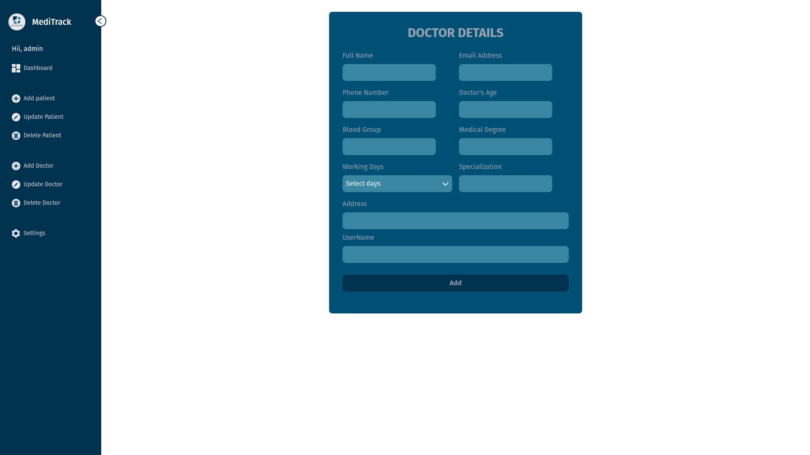

# MediTrack

The Medi-Track is a comprehensive web-based application designed specifically for hospitals to streamline the management of prescriptions and enhance patient care. It offers three key roles - receptionist, doctor, and patient - with tailored functionalities to meet the specific needs of each role.

## Features

- **Receptionist Dashboard** - The receptionist can efficiently manage patient information, including adding, updating, and deleting patient records. They can also add, delete, and update doctor details, assign doctors to patients, and oversee the overall prescription management process.
- **Doctor Dashboard** - Doctors have access to a dedicated dashboard where they can view their assigned patients, write prescriptions, and provide additional details regarding a patient's disease or treatment. The system ensures seamless communication and data flow between doctors and patients.
- **Patient Dashboard** - Patients can log in to their personalized dashboard, where they can access their prescription details, including medication information, dosages, and instructions.

## Tech Stack

#### Frontend

- Frontend Framework: `React.js, Redux`
- Styling: `Tailwind CSS`

#### Backend

- Server: `Django Rest Framework`
- Database: `PostgresSQL`
- API testing: `POSTMAN`
- Authentication: `JWT`
- File Storage: `AWS S3`

#### CI/CD

- Github Actions

## Environment Variables

In order to run the application smoothly, you need to set the following environment variables:

- **EMAIL_HOST_USER**: This should be set to the email address that will be used as the sender for email notifications. For example, you can set it to your hospital's email address or any other valid email address from which the system will send emails.

- **EMAIL_HOST_PASSWORD**: This should be set to the API key provided by Sendinblue or your SMTP provider. This key is used to authenticate the application with the SMTP server when sending emails. Make sure to keep this key secure and do not share it publicly.

Please ensure that you have correctly configured these environment variables with the appropriate values in your application's environment settings. This will enable the application to send emails using the Sendinblue SMTP service.

For example, if you are using Django, you can configure these environment variables in your `settings.py` file as follows:

````python
# settings.py
EMAIL_HOST_USER = 'your_email@example.com'
EMAIL_HOST_PASSWORD = 'your_smtp_api_key'
``````
Make sure to replace 'your_email@example.com' and 'your_smtp_api_key' with the actual email address and SMTP API key provided by Sendinblue.

## API References

### Login API

- **Login existing receptionist**
  ```http
  POST /api/login/receptionist/
    ```
- **Login existing doctor**
  ```http
  POST /api/login/doctor/
    ```
- **Login existing patient**
  ```http
  POST /api/login/patient/
    ```
Create a new user session by providing valid credentials.

#### Request

```json
{
  "username": "your_username",
  "password": "your_password"
}
````

#### Response

```json
{
  "refresh": "your_refresh_token",
  "access": "your_access_token",
  "id": "user_id"
}
```

### Doctor's API

- **Get All Doctors**
  ````http
    GET /api/doctors/
    ```
  | Headers   | Type     | Description                                                        |
  | :------------- | :------- | :----------------------------------------------------------------- |
  | `access token` | `token` | **Required**. token of doctor which we got on login response of login's api |
  ````

#### Response

```json
[
  {
    "username": "doctor1",
    "email": "doctor1@example.com",
    "speciality": "Cardiology",
    "full_name": "Doctor One",
    "blood_group": "A+",
    "doctor_age": 35,
    "phone_number": "1234567890",
    "address": "123 Main St, City",
    "medical_degree": "MD",
    "working_days": ["Monday", "Wednesday", "Friday"],
    "id": "doctor_id"
  },
  {
    "username": "doctor2",
    "email": "doctor2@example.com",
    "speciality": "Pediatrics",
    "full_name": "Doctor Two",
    "blood_group": "B+",
    "doctor_age": 42,
    "phone_number": "9876543210",
    "address": "456 Elm St, Town",
    "medical_degree": "MBBS",
    "working_days": ["Tuesday", "Thursday"],
    "id": "doctor_id"
  },
  ...
]
```

### Patient Detail API

- **Get All Patients (only doctor do have the access of this)**
  ````http
    GET /api/patients/
    ```
  | Headers   | Type     | Description                                                        |
  | :------------- | :------- | :----------------------------------------------------------------- |
  | `access token` | `token` | **Required**. token of doctor which we got on login response of login's api |
  ````

Retrieves details of all patients assigned to doctor.

#### Response

```json
{
  "id": "patient_id",
  "username": "patient1",
  "email": "patient1@example.com",
  "full_name": "Patient One",
  "blood_group": "O+",
  "phone_number": "9876543210",
  "address": "789 Maple St, Village",
  "patient_age": 28,
  "doctor_assigned": "doctor_id"
}
```

## Screenshots

#### HomePage


#### Login Receptionist


#### DashBoard Receptionist



